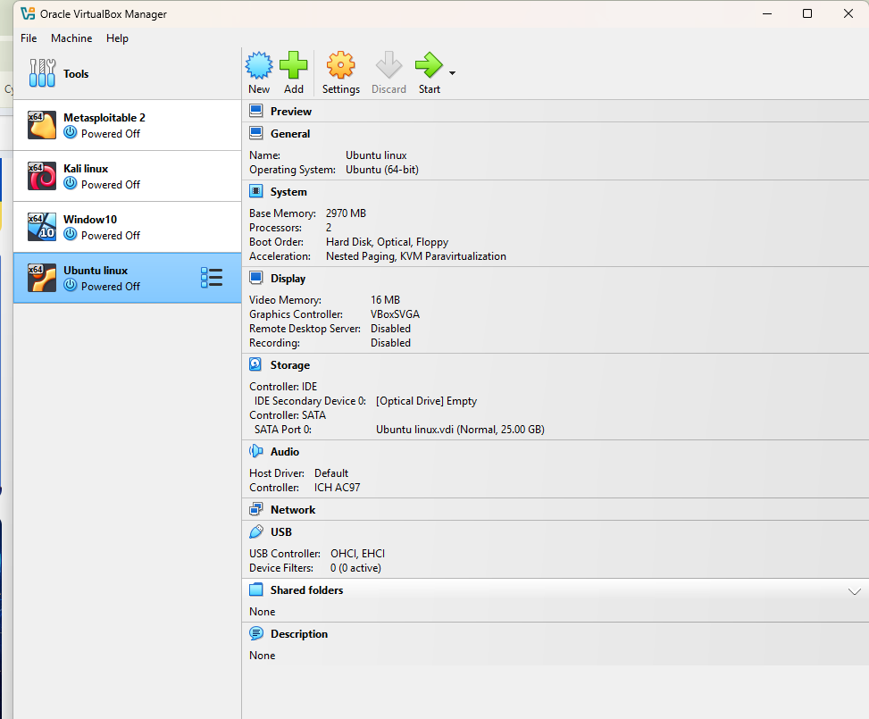
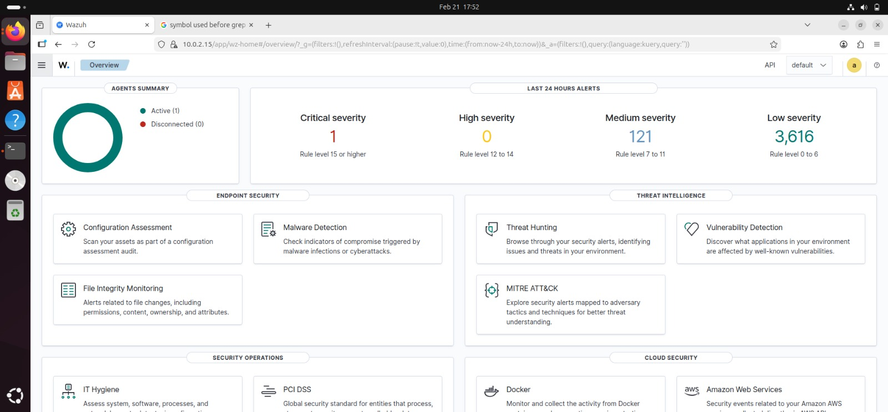
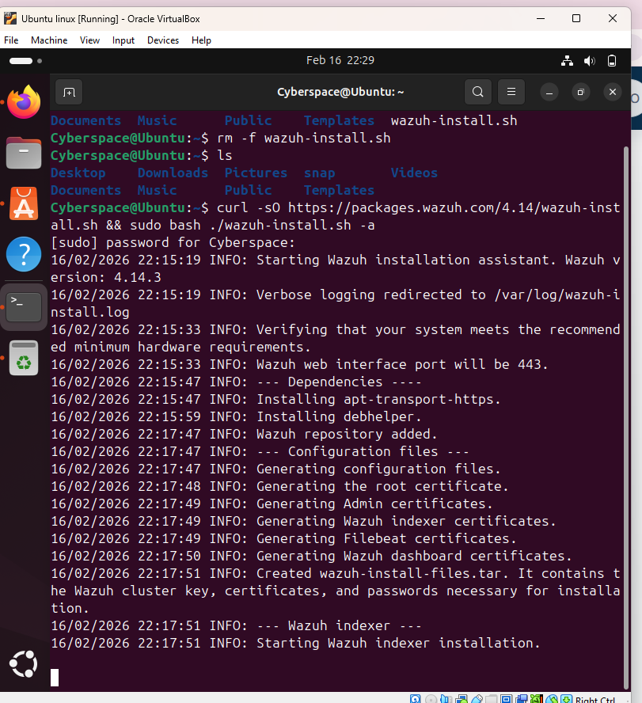
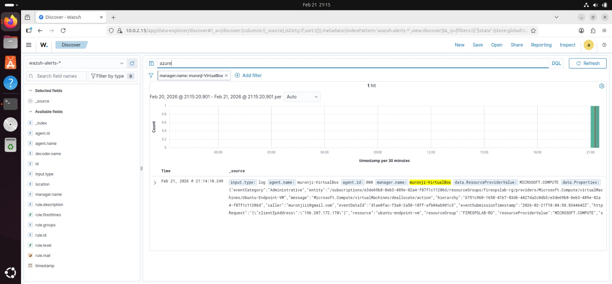
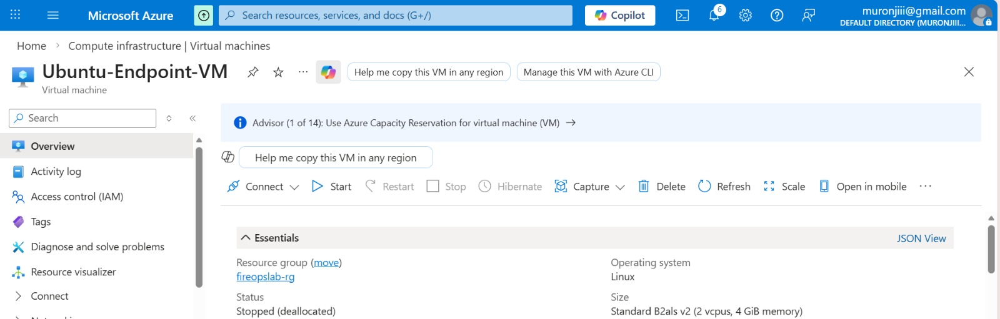
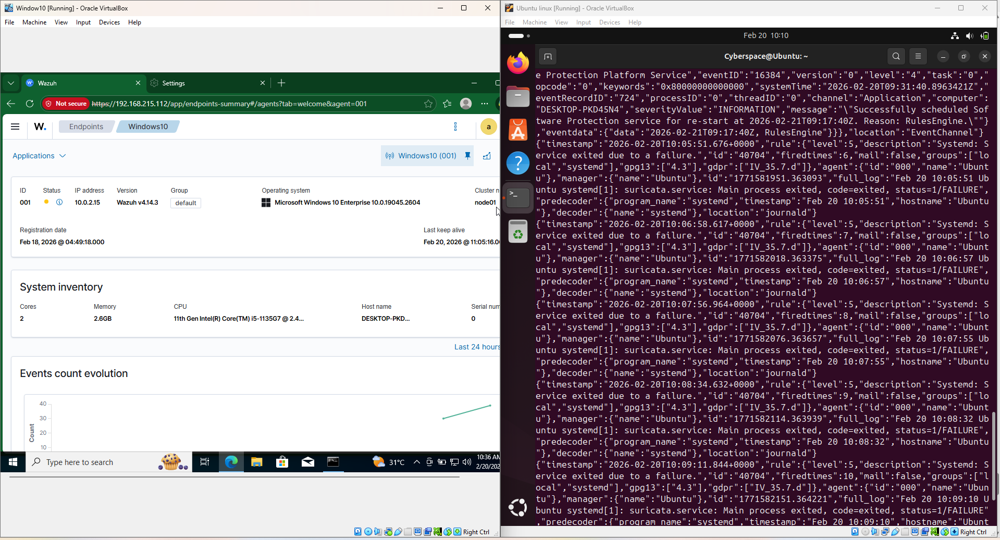
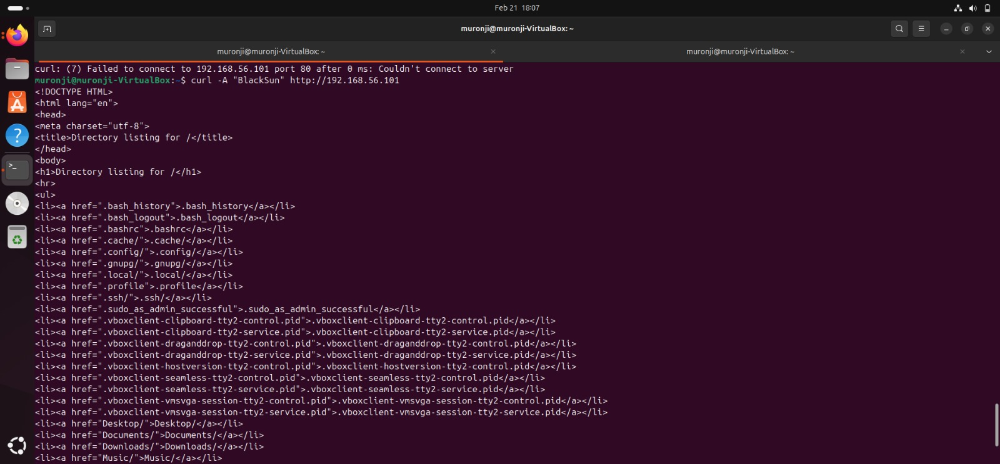
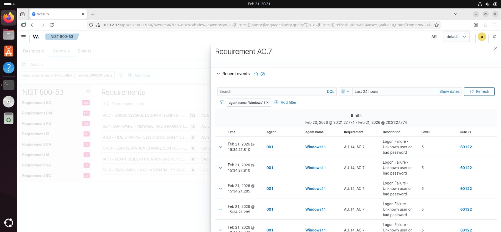
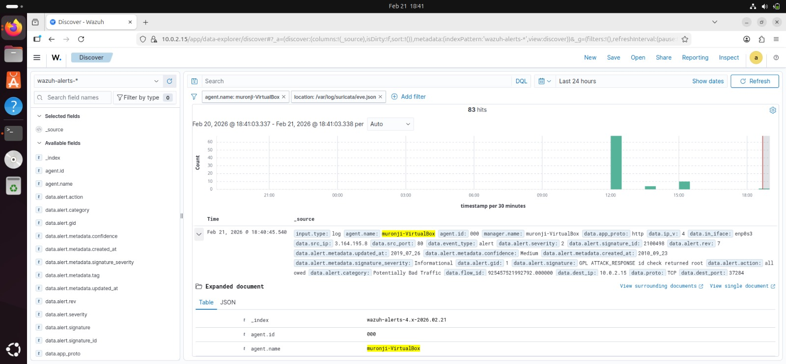

# 🔥 FireOps — SIEM & Intrusion Detection Lab (Wazuh + Suricata)

**Team:** Team B · **Program:** Cybersecurity Internship Project
**Focus Area:** Network Security Monitoring & Attack Detection · **Date:** February 2026

---

## 📌 Abstract

This project presents the deployment and configuration of a Security Information and Event Management (SIEM) system using **Wazuh** integrated with the **Suricata** Intrusion Detection System (IDS). The goal was to build a functional security monitoring lab capable of detecting brute force attacks, monitoring file integrity changes, and analyzing security events in real time — implemented entirely in a controlled virtual machine environment.

---

## 🎯 Project Objectives

- Deploy and configure **Wazuh SIEM**
- Install and integrate **Suricata IDS**
- Enable **File Integrity Monitoring (FIM)**
- Simulate **brute force attacks** using Kali Linux
- Analyze generated alerts in the Wazuh dashboard

---

## 🏗️ Lab Architecture & Environment Setup

The lab environment consisted of four virtual machines:

- **Wazuh Manager** — central SIEM server
- **Ubuntu Agent** — monitored Linux endpoint
- **Windows 10 Target Machine** — brute-force attack target
- **Kali Linux Attacker Machine** — used to simulate attacks




---

## 🧰 Tools & Technologies

`VirtualBox` · `Wazuh SIEM` · `Suricata IDS` · `Kali Linux` · `Ubuntu Server` · `Windows 10`

---

## ⚙️ Installation & Configuration

**Wazuh Manager install:**
```bash
curl -sO https://packages.wazuh.com && sudo bash ./wazuh-install.sh -a
```



**Suricata install (Ubuntu/Debian):**
```bash
sudo add-apt-repository ppa:oisf/suricata-stable && sudo apt update && sudo apt install suricata -y
```

**Wazuh Agent install & startup:**
```bash
WAZUH_MANAGER="10.0.2.5" apt-get install wazuh-agent
sudo systemctl daemon-reload && sudo systemctl enable wazuh-agent && sudo systemctl start wazuh-agent
```

---

## ☁️ Azure VM Deallocation Activity

Azure activity logs were reviewed to trace what triggered VM deallocation events during the lab.




---

## 🔗 Suricata Integration with Wazuh

Suricata was configured to generate logs in JSON format (`eve.json`), which were integrated into Wazuh for centralized monitoring and alert generation.



---

## 💥 Brute Force Attack Simulation

A brute force attack was simulated from the Kali Linux attacker machine, targeting the Windows 10 victim machine, with the objective of triggering authentication failure alerts in Wazuh.

---

## 📊 Alert Monitoring & Log Analysis

Security alerts were analyzed by severity level (Critical, High, Medium, Low), with logs reviewed to identify attack patterns and suspicious behavior.

---

## 🔎 Security Findings

The SIEM system successfully detected:
- Brute force authentication attempts
- File integrity violations
- Suspicious network traffic patterns





---

## ⚠️ Challenges Encountered

- Suricata logs not initially appearing in the Wazuh dashboard
- Agent disconnection required troubleshooting
- JSON log configuration errors — resolved through reconfiguration

---

## 📚 Lessons Learned

This project strengthened practical skills in SIEM deployment, IDS configuration, log analysis, and incident detection techniques across a multi-VM lab environment.

---

## ✅ Conclusion

The successful deployment of Wazuh and Suricata demonstrates the effectiveness of SIEM solutions in monitoring, detecting, and analyzing cybersecurity threats in real time — from brute force detection through to network intrusion alerting.

*Team B — Cybersecurity Internship Project — February 2026*
